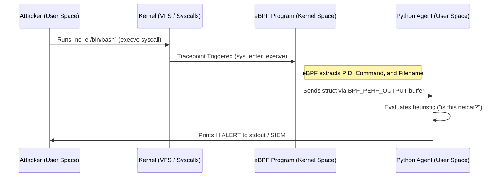

# Lab: Real-Time Reverse Shell Detection with eBPF

**Module:** Threat Detection & Systems Internals  
**Difficulty:** Advanced (Level 2)  
**Environment:** Privileged Docker Container (Ubuntu 22.04)

## 📌 Overview

In this lab, you will move beyond configuring existing security tools (like SIEMs) and dive into the Linux kernel itself. You will write a custom **eBPF (Extended Berkeley Packet Filter)** program using **BCC (BPF Compiler Collection)** and Python. 

Your eBPF program will hook into the kernel's `execve` tracepoint to monitor process creation in real-time. If it detects a suspicious binary execution—such as `netcat` or `bash` being spawned in a reverse-shell context—it will instantly stream an alert to user-space.

---

## 🏗️ Architecture



---

## 🛠️ Step 1: The Lab Environment (`Dockerfile`)

Because eBPF interacts directly with the Linux kernel, it requires root privileges and specific kernel headers. To keep your host machine safe and clean, we will run the lab inside a privileged Docker container.

Create a file named `Dockerfile`:

```dockerfile
# Use a standard Ubuntu base image
FROM ubuntu:22.04

# Avoid tzdata interactive prompts
ENV DEBIAN_FRONTEND=noninteractive

# Install BCC tools, Python bindings, and netcat for our attack simulation
RUN apt-get update && apt-get install -y \
    bpfcc-tools \
    python3-bpfcc \
    linux-headers-generic \
    netcat \
    && rm -rf /var/lib/apt/lists/*

WORKDIR /lab
COPY detector.py .

# Keep the container running
CMD ["/bin/bash"]
```

---

## 💻 Step 2: The eBPF Threat Detector (`detector.py`)

Create a file named `detector.py`. This script contains two parts: 
1. The **C Code** that runs *inside* the kernel (capturing the syscall).
2. The **Python Code** that runs in user-space (reading the buffer and generating alerts).

```python
#!/usr/bin/env python3
from bcc import BPF

# 1. The eBPF C Program
bpf_text = """
#include <uapi/linux/ptrace.h>
#include <linux/sched.h>
#include <linux/fs.h>

// Define the data structure we will send to user-space
struct data_t {
    u32 pid;
    char comm[TASK_COMM_LEN];
    char fname[256];
};

// Define a perf ring buffer to stream events to Python
BPF_PERF_OUTPUT(events);

// Hook the 'execve' syscall tracepoint
TRACEPOINT_PROBE(syscalls, sys_enter_execve) {
    struct data_t data = {};
    
    // Get Process ID
    data.pid = bpf_get_current_pid_tgid() >> 32;
    
    // Get the name of the process making the syscall
    bpf_get_current_comm(&data.comm, sizeof(data.comm));
    
    // Get the filename being executed
    bpf_probe_read_user_str(&data.fname, sizeof(data.fname), args->filename);
    
    // Submit the data to the perf buffer
    events.perf_submit(args, &data, sizeof(data));
    return 0;
}
"""

# 2. Python User-Space Agent
# Compile and inject the eBPF program into the kernel
b = BPF(text=bpf_text)

print("🚀 eBPF Reverse Shell Detector running... (Press Ctrl+C to stop)")
print(f"{'PID':<10} {'CALLING COMM':<15} {'FILE EXECUTED'}")

# Callback function to handle data from the perf buffer
def print_event(cpu, data, size):
    event = b["events"].event(data)
    fname = event.fname.decode('utf-8', 'replace')
    comm = event.comm.decode('utf-8', 'replace')
    
    # Threat Heuristic: Alert if netcat (nc) is executed
    alert = "🔴 ALERT: Potential Reverse Shell!" if "nc" in comm or "nc" in fname else ""
    
    print(f"{event.pid:<10} {comm:<15} {fname:<30} {alert}")

# Open the perf buffer and attach the callback
b["events"].open_perf_buffer(print_event)

# Infinite loop to keep reading the buffer
while True:
    try:
        b.perf_buffer_poll()
    except KeyboardInterrupt:
        print("\nExiting...")
        exit()
```

---

## 🎯 Step 3: Execution and Attack Simulation

Now, let's build the environment, run the detector, and simulate a reverse shell attack.

### 1. Build and Run the Container
You must use `--privileged` and mount the host's `/sys/kernel/debug` directory for eBPF to function correctly inside Docker.

```bash
docker build -t ebpf-lab .
docker run -it --rm --privileged -v /sys/kernel/debug:/sys/kernel/debug:rw ebpf-lab
```

### 2. Start the eBPF Detector
Inside the container, run your Python script in the background (or in a separate terminal tab):
```bash
python3 detector.py &
```
*(You will see the startup message and table headers appear).*

### 3. Simulate the Attack
Now, act as the attacker. Try to execute a standard benign command first, then simulate a reverse shell using `netcat`.

```bash
# Benign execution (will be logged, but no alert)
ls -la

# Malicious execution (Reverse Shell)
nc -lvnp 4444 -e /bin/bash
```

### 4. Observe the Telemetry
Your eBPF program intercepts the syscalls deep within the kernel and immediately outputs:
```text
PID        CALLING COMM    FILE EXECUTED
104        bash            /usr/bin/ls                    
105        bash            /usr/bin/nc                    🔴 ALERT: Potential Reverse Shell!
```

---

## 🧠 Metacognition & Takeaways

By completing this lab, you have bridged the gap between *System Administration* and *Kernel Engineering*. 
*   **Why is this better than traditional logging?** Standard logs (like `syslog` or `bash_history`) can be tampered with or bypassed by attackers. Because eBPF hooks into the kernel's tracepoints, the attacker *cannot* hide the `execve` syscall from the OS, making this telemetry tamper-proof.
*   **Next Steps:** How would you modify the C code to actually *block* the execution instead of just logging it? (Hint: Look into eBPF `LSM` (Linux Security Modules) or `bpf_override_return`).
