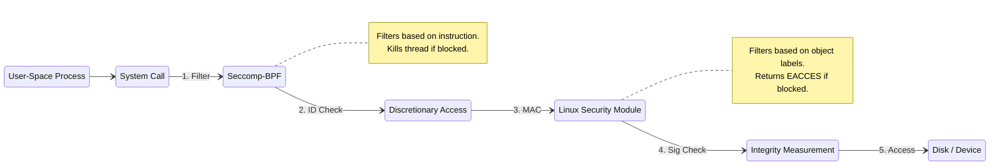

# Linux Security — Deep Dive: Production Scenarios

---

## 🏛️ Architecture: The Kernel Defense-in-Depth Pipeline

Before diving into scenarios, a Senior Engineer must understand **order of operations**. When a user-space process makes a system call (e.g., `open()` or `execve()`), the Linux kernel passes it through a strict gauntlet. 



> [!TIP]
> **The Bouncer vs. The Camera Analogy (Trade-Off Mechanics)**
> Why do we need Seccomp if we have SELinux? 
> **Seccomp** is the bouncer at the club's front door; it only looks at the ID (the syscall number). If a process tries to call `ptrace()`, Seccomp kicks it out immediately. It doesn't care *what* you are trying to ptrace.
> **SELinux/LSM** is the security camera inside the club. It doesn't care that you called `open()` (you are allowed in the club), but it cares *which specific file* (`shadow_t`) you are trying to touch. Using both ensures an attacker can't exploit a kernel bug via an obscure syscall *and* can't touch unauthorized files if they find an exploit.

---

## Scenario 1 — Web RCE that goes nowhere because the service was confined

**Symptom.** IDS alerts on a webshell upload to a PHP app. Incident response expects lateral movement; there is none.

**Why it stalled.** The `httpd` service ran:
- domain `httpd_t` (SELinux targeted policy, `getenforce` = Enforcing)
- `CapabilityBoundingSet=CAP_NET_BIND_SERVICE`, `NoNewPrivileges=yes`
- `SystemCallFilter=@system-service` minus `@privileged @mount @debug`
- `ProtectHome=yes ProtectSystem=strict ReadWritePaths=/var/www/uploads`

The attacker had code-exec as `apache` but:
```text
read /etc/shadow          -> SELinux DENY (httpd_t shadow_t:file read)
setuid(0)                 -> NoNewPrivileges: EPERM (Deliberate Failure)
ptrace(sshd)              -> seccomp KILL (Thread dies instantly)
load kernel module        -> no CAP_SYS_MODULE + lockdown
write /usr/bin/x          -> ProtectSystem=strict: EROFS (Read-only fs)
mount --bind              -> seccomp EPERM + no CAP_SYS_ADMIN
```

> [!IMPORTANT]
> **Deliberate Failure Mechanic: `NoNewPrivileges`**
> What exactly happens when an attacker runs `sudo` inside a container with `NoNewPrivileges=yes`? 
> The kernel sets the `PR_SET_NO_NEW_PRIVS` bit in the task struct. When `execve` hits a `setuid` binary (like `sudo`), the kernel *intentionally ignores the setuid bit* and executes it as the current user, returning `EPERM` (Operation not permitted) when `sudo` tries to escalate. It fails safely rather than crashing.

---

## Scenario 2 — `audit2allow` used as a "make it work" button

**Symptom.** A new app throws SELinux denials. Someone runs `ausearch -m avc -ts recent | audit2allow -M myapp && semodule -i myapp.pp` until the denials stop. A month later a pentest reads `/etc/shadow` through the app.

**What went wrong.** `audit2allow` generated `allow httpd_t shadow_t:file read;` because at some point the app *tried* it (a misconfigured library). The blanket "allow whatever it asked for" re-opened the exact hole SELinux exists to close.

**The right process.**
1. Look at *every* denial. Ask "should it be doing this?"
2. Legit-but-mislabelled file → `semanage fcontext -a -t httpd_sys_content_t '/srv/site(/.*)?'` + `restorecon`. Fix the **label**, not the policy.
3. Legit new access pattern → a **narrow** custom module, reviewed.
4. Illegitimate (the shadow read) → fix the app; never allow it.

---

## Scenario 3 — Building a seccomp profile for a service

**Goal.** Ship `SystemCallFilter=` / a Docker seccomp JSON that is default-deny without breaking the app.

**Method.**
```bash
# 1. run under audit in staging, capture every syscall it makes
strace -f -qcf -o trace.txt ./app --run-realistic-load

# 2. derive the set
awk '/^[a-z_]+\(/{sub(/\(.*/,"");print}' trace.txt | sort -u > allow.txt

# 3. start from a curated base and subtract
#    systemd: SystemCallFilter=@system-service
#             SystemCallFilter=~@privileged ~@resources
```

**Traps.**
- JITs (`node`, `python -X`) need `mprotect`/`pkey_mprotect`; block them wrong and you get a silent crash.
- **Chaos/Failure Design:** `SCMP_ACT_ERRNO` is safer than `SCMP_ACT_KILL` for a first rollout. If you use `KILL`, the kernel sends `SIGSYS` and the process vanishes without a log. `ERRNO` returns an error code to the app, allowing it to gracefully degrade and log the failure.

---

## Scenario 4 — `--privileged` container on a shared box

**Symptom.** A CI job "needs" `docker run --privileged` (or a k8s Pod with `securityContext.privileged: true`) to build images / run tests.

**What `--privileged` actually removes.** All capability drops, the seccomp filter, the AppArmor/SELinux confinement, and the masked `/proc` and `/sys` paths. The container can now load kernel modules, write raw disks, and `nsenter` the host. **It is a host root shell with extra steps.**

**Replace it with the specific thing needed.**
| "needs privileged" for… | give instead |
|---|---|
| FUSE | `--device /dev/fuse --cap-add SYS_ADMIN` |
| raw packets | `--cap-add NET_RAW NET_ADMIN` |
| perf/eBPF | `--cap-add BPF PERFMON SYS_PTRACE`, `--security-opt seccomp=unconfined` |

---

## Scenario 5 — Integrity: proving the node runs what you shipped

**Requirement.** An accreditor asks you to demonstrate that compute nodes cannot run unsigned kernel code.

**Stack.**
- **Secure Boot** on; shim + vendor cert or your own MOK.
- `CONFIG_MODULE_SIG_FORCE=y` and `lockdown=integrity` on the kernel cmdline — even root can't `insmod` an unsigned module or `kexec` an unsigned kernel.
- **IMA appraisal** (`ima_appraise=enforce`) blocks execution of files without a valid signed `security.ima` xattr.

---

## Quick reference

```bash
getenforce ; sestatus ; ps -eZ | grep <svc>
ausearch -m avc,user_avc,selinux_err -ts recent ; sealert -a /var/log/audit/audit.log
semanage fcontext -l | grep <path> ; matchpathcon <path> ; restorecon -Rv <path>
getcap -r / 2>/dev/null ; getpcaps <pid> ; capsh --print
systemd-analyze security <unit>            # ranks a unit's sandboxing 0-10
cat /sys/kernel/security/lockdown ; mokutil --sb-state
```

<!-- Mermaid JS for GitHub Pages -->
<script type="module">
  import mermaid from 'https://cdn.jsdelivr.net/npm/mermaid@10/dist/mermaid.esm.min.mjs';
  mermaid.initialize({ startOnLoad: false });
  document.addEventListener('DOMContentLoaded', async () => {
    const codeBlocks = document.querySelectorAll('code.language-mermaid');
    for (let block of codeBlocks) {
      const pre = block.parentElement;
      const mermaidDiv = document.createElement('div');
      mermaidDiv.className = 'mermaid';
      mermaidDiv.textContent = block.textContent;
      pre.replaceWith(mermaidDiv);
    }
    await mermaid.run();
  });
</script>
